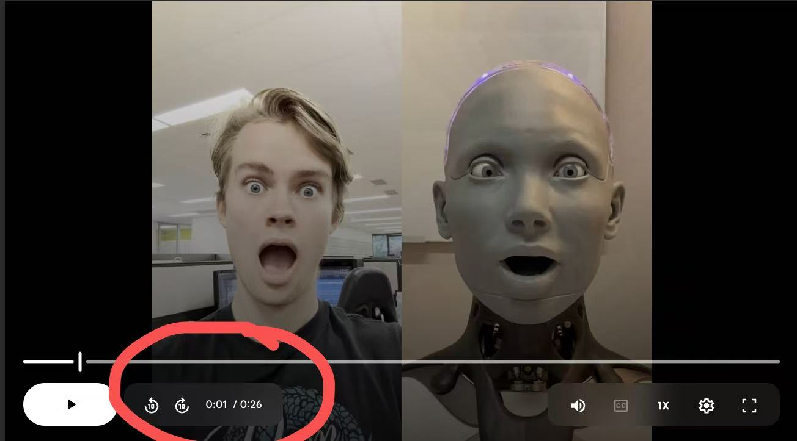
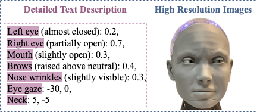

# Realistic Humanoid Facial Expression Imitation

- **Women in STEM Research Internship 2025, Macquarie University.**
- **Supervisors:** Prof. Longbing Cao (Distinguished Chair in AI), Penny (Peizhen Li)

## Stage 1: Paper Reading & Target Data Selection (15.Mar.2025~30.Mar.2025)
### Tasks
1️⃣ **Read the following papers on image animation/motion transfer (~6 hrs):**
   - [LivePortrait: Efficient Portrait Animation with Stitching and Retargeting Control](https://arxiv.org/pdf/2407.03168)
  
   📣 **Note:** 
   1. You **do not** need to dive into every detail—focus on understanding the core concepts, what the technique achieves, 
   and how it can be applied to transfer motions or facial expressions from a human to a humanoid robot.
   2. Feel free to take notes or jot down ideas based on your reading.

2️⃣ **Watch the following videos of "robot imitating human" (our preliminary experimental results) and capture screenshots when
   the robot performs well(~4 hrs):**
   - [imitation results](https://drive.google.com/drive/folders/1htHpBTDGMyzFEux344Wd4FjWR8pbVZv7?usp=sharing)
  
   📣 **Note:** 
   1. Include timestamps in your screenshots, following the example image below: 
   2. Organize the screenshots into a zipped folder, a .pptx file, or any other preferred format.
   3. As you watch, reflect on where the imitation results are successful and where they fall short.

## Stage 2: Facial Landmark-Aware Nuanced Expresion Imitation  (7.Apr.2025~30.Apr.2025)
### Tasks
1️⃣ **Read the following papers on facial behaviour analysis:**
   - [OpenFace: an open source facial behaviour analysis toolkit](https://ieeexplore.ieee.org/stamp/stamp.jsp?tp=&arnumber=7477553)

2️⃣ **Conduct an exploration of the following questions, including reference papers or technical blogs where applicable.**
   1. How would you define **facial behaviour**? 
   2. How would you describe facial expressions with respect to facial landmarks, or the displacements of facial landmarks?
   3. Previously, you read the paper on implicit keypoint-based portrait animation. Could you make a comparison between **keypoints** and **facial landmarks**? 
   4. Could you describe facial expressions—or the causes of facial expressions—from a biological perception perspective?
   5. What could be the key to capturing emotional nuances from a visual perception perspective?

   📣 **Note:** 
   1. Please provide clear and detailed answers based on your own understanding.
   2. Organize your answers in a PDF file (no longer than 2 pages) and email [Penny](mailto:peizhen.li1@hdr.mq.edu.au) once you're finished 😄.  
    
## Stage 3: Future Work  (~30.May.2025)
### Introduction
As a future direction of this imitation project, we aim to contribute a dataset for <strong>humanoid facial expression generation</strong>—specifically, generating <strong>nuanced</strong> facial expressions conditioned on user-provided text descriptions. The dataset is designed for model training and consists of pairs of humanoid facial expression images and corresponding textual descriptions. (See the example provided below; the numbers indicate intensity levels within specified ranges.)

### Tasks
1️⃣ **Text Annotation: Inspection and Formatting**
  1. <strong>Do you think the level of granularity in the text description provided in the example above is appropriate?</strong> Or should we use a more fine-grained description to capture nuanced or intricate facial expressions?
  2. <strong>Could you suggest alternative annotation formats</strong> for representing nuanced humanoid facial expressions, as illustrated in the example above?

📣 **Note:** 
   1. You may refer to other text-to-image generation models for their text annotation conventions and formatting practices (However, our objective is to generate **nuanced** humanoid facial expressions that differ from those in prior work, so please feel free to explore beyond existing approaches).

      - [High-Resolution Image Synthesis with Latent Diffusion Models](https://arxiv.org/pdf/2112.10752) 
      - [LAION-400M: Open Dataset of CLIP-Filtered 400
Million Image-Text Pairs](https://arxiv.org/pdf/2111.02114)
   2. Organize your answers in a PDF file (no longer than 1 page) and email [Penny](mailto:peizhen.li1@hdr.mq.edu.au) once you're finished 😄.
 

🔚 **Concluding remarks:**
 Hope you enjoy the journey! 😄